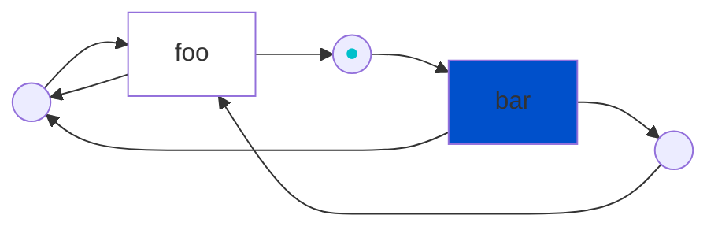

# Symmetri

A C++-17 library that takes a Petri net and turns it into a program. This is done by mapping *[transitions](https://en.wikipedia.org/wiki/Petri_net#Petri_net_basics)* to *functions* and calling the functions for which their transition counterpart is *[fireable](https://en.wikipedia.org/wiki/Petri_net#Execution_semantics)*. Petri nets are a graphical language that naturally can model concurrent and distributed systems ([*wikipedia*](https://en.wikipedia.org/wiki/Petri_net#Petri_net_basics)).

## Principle

The graph below represents a Petri net. The transitions `bar` is fireable, and if it would fire it would consume the *token* (<span style="color:#00c0cb;">&#9679;</span>) and produce two new tokens in the output places. These new tokens would enable `foo` and the cycle would continue for ever, while accumelating tokens in the most left place.



This Petri net can be described using Symmetri:

```cpp
using namespace symmetri;
Net net = {{"foo",
            {{{"B", Success}, {"C", Success}},
              {{"Z", Success}, {"B", Success}}}},
            {"bar",
            {{{"Z", Success}},
              {{"B", Success}, {"C", Success}}}}};
Marking initial = {{"Z", Success}};
Marking goal = {};
auto task_system = std::make_shared<TaskSystem>(4);
PetriNet app(net, "test_net_without_end", pool, initial, goal);
app.registerCallback("foo", &foo);
app.registerCallback("bar", &bar);
auto result = fire(app);  // run until done.
auto log = getLog(app); // get the event log
```

- `net` is a multiset description of a Petri net
- `initial` is the initial token distribution (also known as _initial marking_)
- `goal` is the goal marking, the net terminates if this is reached
- `task_system` is a simple SPMC-queue based threadpool
- `&foo` and `&bar` are user-supplied *Callbacks*
- `app` is all the ingredients put together - creating something that can be *fired*! it outputs a result (`res`) and at all times an event log can be queried

## Build

Clone the repository and make sure you also initialize the submodules:

```bash
git clone https://github.com/thorstink/Symmetri.git
git submodule update --init --recursive
mkdir build
cd build
# Debug build without sanitizers
cmake -DCMAKE_BUILD_TYPE=Debug -DBUILD_EXAMPLES=ON -DBUILD_TESTING=ON -DASAN_BUILD=OFF -DTSAN_BUILD=OFF ..
# Building and running tests:
make && make test
```

## Run examples

```bash
# assumes you build the examples
# finishes by reaching the final marking (e.g. completed). Use keyboard to interact pause/resume/cancel/print log
./build/examples/flight/symmetri_flight nets/PT1.pnml nets/PT2.pnml nets/PT3.pnml
```

## Implementation

Some details on the implementation.

<p align="center" width="100%">
<picture>
  <source media="(prefers-color-scheme: dark)" srcset="./docs/img/architecture_dark.svg">
  <source media="(prefers-color-scheme: light)" srcset="./docs/img/architecture_light.svg">
  
</picture>
</p>

## State of the library

Still in alpha! Improving as we go. None the less, Symmetri is already being used in industry ;-). Feel free to contact me if you are curious or have questions.
