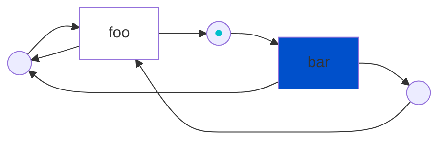
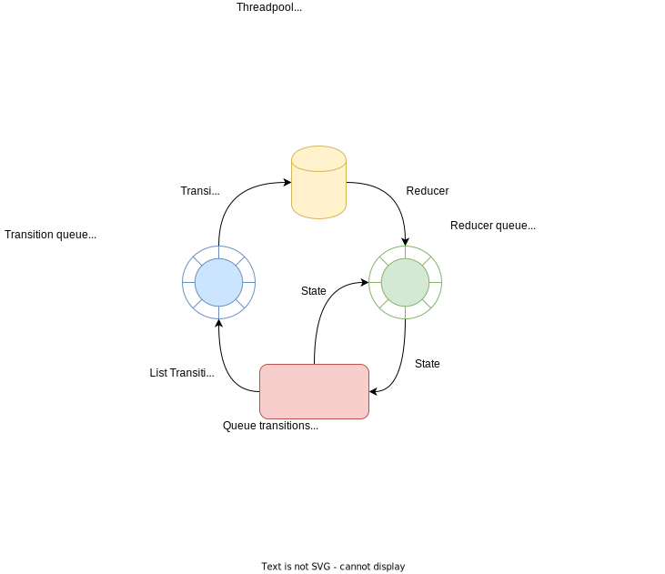

# Symmetri

A C++-17 library that takes a Petri net and turns it into a program. This is done by mapping *[transitions](https://en.wikipedia.org/wiki/Petri_net#Petri_net_basics)* to *functions* and calling the functions for which their transition counterpart is *[fireable](https://en.wikipedia.org/wiki/Petri_net#Execution_semantics)*. Petri nets are a graphical language that naturally can model concurrent and distributed systems ([*wikipedia*](https://en.wikipedia.org/wiki/Petri_net#Petri_net_basics)).

## Principle

The graph below represents a Petri net. The transitions `bar` is fireable, and if it would fire it would consume the *token* (<span style="color:#00c0cb;">&#9679;</span>) and produce two new tokens in the output places. These new tokens would enable `foo` and the cycle would continue for ever, while accumelating tokens in the most left place.



This Petri net can be described using Symmetri:

```cpp
using namespace symmetri;
Net net = {{"foo", {{"B", "C"}, {"Z", "B"}}},
                {"bar", {{"Z"}, {"B", "C"}}}};
Store store = {{"foo", &foo}, {"bar", &bar}};
std::vector<std::pair<symmetri::Transition, int8_t>> priority = {};
Marking m0 = {{"Z", 1}, {"B", 0}, {"C", 0}};
StoppablePool stp(1);
symmetri::Application app(net, m0, {}, store, priority,
                          "test_net_without_end", stp);
auto [eventlog, res] = app.execute(); // run untill done.
```

- `net` is a multiset description of a Petri net
- `store` is a lookup table that links the *symbolic* transitions to actual functions
- `priority` can be used if some transitions are more equal than others ([Wiki on prioritized Petri nets](https://en.wikipedia.org/wiki/Prioritised_Petri_net))
- `m0` is the initial token distribution (also known as _initial marking_)
- `stp` is a simple lockfree-queue based threadpool
- `app` is all the ingredients put together - creating something that can be executed! it outputs a result (`res`) and a log (`eventlog`)

## Build

Clone the repository and make sure you also initialize the submodules.

```bash
mkdir build
cd build
cmake .. -DBUILD_TESTING=0 -DBUILD_EXAMPLES=0
cmake .. -DBUILD_TESTING=1 -DBUILD_EXAMPLES=0
cmake .. -DBUILD_TESTING=1 -DBUILD_EXAMPLES=1
```

## Run

```
cd ../build
./examples/flight/symmetri_flight ../nets/PT1.pnml ../nets/PT2.pnml ../nets/PT3.pnml
# or
./Symmetri_hello_world ../nets/passive_n1.pnml ../nets/T50startP0.pnml
```

and look at `http://localhost:2222/` for a live view of the activity.

## Implementation

Some details on the implementation.

<picture>
  <source media="(prefers-color-scheme: dark)" srcset="./docs/img/architecture_dark.svg">
  <source media="(prefers-color-scheme: light)" srcset="./docs/img/architecture_light.svg">
  
</picture>

## WIP / TODO

- research transition guards/coloured nets

https://www.youtube.com/watch?v=2KGkcGtGVM4
https://stlab.cc/tip/2017/12/23/small-object-optimizations.html

# Cloc

https://www.youtube.com/watch?v=2KGkcGtGVM4
https://stlab.cc/tip/2017/12/23/small-object-optimizations.html
```
cloc --exclude-list-file=.clocignore .
```
