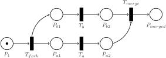

# Symmetri nets

## Introduction

Transition T1 is enabled             |  Conflict: either T1 or T2 wil fire | T1 and T2 *can* run in parallel. T3 will always run after T1 and T2
:-------------------------:|:-------------------------:|:-------------------------:
  |    |  

There are many variations in Petri nets. In the most basic form there are transitions that produce tokens that are indistinguishable (e.g. if a place holds two tokens you can not distinguish one token from the other) and firing is atomic (meaning that tokens are consumed and produced instantaneous at the moment of firing). All transitions are also equal in the sense that if two transitions are simultaneously active, meaning their input places have the required amount of tokens, the order of firing is not determined. In a special case the transitions can be simultaneously active and share input places, this is called conflict. In Symmetri Petri Nets are used to encode the process- or business-logic of a (software) program. In many realistic applications the aforementioned properties are, subtly put, not ideal for modelling. In this text I will explain what kind of ‘Petri net modifications’ are applied to make Petri nets more applicable to the use-case of Symmetri: modelling business logic. I call the resulting cocktail of Petri net semantics Symmetri nets.

## Transitions as callbacks

In Symmetri, transitions represent callbacks. The topology of a Petri net determines the possible sequences in which transitions, or callbacks, can be executed. Callbacks can be immediately executed (synchronous) or deferred (asynchronous). In the immediate case the marking mutation associated with a transition can be considered atomic. In the deferred case it is not that simple. If the marking mutation is atomic, when would that be? When the callback is scheduled? Or when the callback completes? In all cases the behaviour can be misleading. If the we take the act of scheduling as marking mutation time, then the next transition is enabled before the former completes. If we take the act of completion as mutation time, we simply do not consume the token from the input place and the situation arises that we could schedule the transition multiple times as long as it does not complete. The sensible solution for the Symmetri take on transitions is to split the atomic marking mutation into two atomic marking mutations: one for consumption at the moment of scheduling and one for production at the moment of completion.

## Conflict and priorities

There is also the complication of conflict. Conflict arises if two or more transitions are simultaneously active and share input places - forcing a choice to fire one of the active transitions. In the basic definition of a Petri net, firing is non-deterministic, so a random active transitions is fired, disabling the other transition. It is possible to define a firing policy to make firing in such cases deterministic. One way to achieve this is by [assigning priorities](https://en.wikipedia.org/wiki/Prioritised_Petri_net) (as integers) to transitions. In cases of conflict, the transitions are fired in order of priorities. In the case of equal priorities, the original conflict arises again. This can be mitigated by a higher priority granularity or a specifically tailored policy. In Symmetri we allow only priorities ranging from -128 to 127, and where 0 is the default priority. Priorities should be a ‘tool of last resort’ - and conflict should ideally be avoided when designing the Petri net.

## Failure at the level of transitions

When firing is atomic there is no room for failure of transitions. They either fire and cause a marking mutation or they do not. In Symmetri, the atomic mutation is split into consumption and production, and these mutations are processed at different points in time. The execution or scheduling of a callback will still always consume tokens. The production of tokens however, can be made dependent on the outcome of a callback. Being able to withhold token production gives modelling capabilities to alter transition sequences and even create a deadlock on purpose in cases of failures inside a callback. This kind of behaviour is favourable if one wants to [fail fast](https://en.wikipedia.org/wiki/Fail-fast).

## Input from abroad

Transitions can fire if their input places have the required amount of tokens. What happens if a transition has no input place? Transitions without input places are referred to as source transitions and they are unconditionally active. Instead of firing them at random, in Symmetri they can be used to insert events from outside into the Petri net. The topological opposite, sink transitions, only have input places and hence do not produce tokens. Because sink transitions have no output it is, in the interpretation of Symmetri, impossible to determine wether the associated callback failed. The Symmetri approach is to not do anything that might fail in callbacks that are source- or sink-transitions.

## The event log

Because callbacks can have variable durations before they generate a result and a Petri net itself does not enforce an exact sequence of transitions in the case of parallelism, it can be the case that there are multiple transition sequences that create the same result (e.g. marking). This is exactly the power of Petri nets over Finite State Machines. Petri nets define a set of transition sequences that are valid, while in FSMs you need to explicitly model each transition sequence, which scales poorly if multiple processes are run in parallel.

Not having to define every possible sequence can be a work-saver, however, it can be interesting to retrospectively inspect the actual executed transition sequence. For this Symmetri creates an event log. Symmetri’s event log definition is inspired by the [definition used in Process mining](https://en.wikipedia.org/wiki/Process_mining#:~:text=Input%20for%20process%20mining%20is,and%20(3)%20a%20timestamp.);

Each event in the log should contain:
- a unique identifier for a particular process instance (called case id),
- an activity (description of the event that is occurring), and
- a timestamp

In Symmetri the unique identifier consists out of an identifier for the transition and an identifier for the parent Petri net the transition is a part of. This combination guarantees that we have an unique identifier also in nested Petri nets. The activity in Symmetri is considered more as the state changes during the firing “lifecycle”. This means the event log is populated mostly with scheduled, started, completed. The timestamp is based on a monotonic system clock.

The resulting event log, which is ordered by timestamps, give a chronological source of events what happened when.
