# Flight

This is a little application that parses three Petri nets and uses multiple ways of composing to demonstrate the capabilities. It also demonstrates how to implement custom behavior for *fire*, *pause* and *cancel* using a user supplied class `Foo` in `transitions.hpp`.

## installing

You can build and install to a local `install`-directory:

```bash
mkdir build
cd build
cmake -DBUILD_EXAMPLES=ON -DBUILD_TESTING=OFF ..
make
```

You will also need a little local webserver if you want to visualize the Gantt-chart online. See below how it could look. In this example [live-server](https://github.com/tapio/live-server) is used because it has fancy hot reloading.

You can run it like this:

```bash
live-server --port=8000 --open=./examples/flight/index.html --watch=./examples/flight & \
./build/examples/flight/symmetri_flight nets/PT1.pnml nets/PT2.pnml nets/PT3.pnml && \
fg
```

And you should be able to watch [http://127.0.0.1:8000/examples/flight/](http://127.0.0.1:8000/examples/flight/)

You can interact with the application through simple keys followed by an [enter]

```bash
input options:
 [p] - pause
 [r] - resume
 [x] - exit
 ```

# Mermaid example

```mermaid
---
displayMode : compact
---
gantt
title A Gantt Diagram
dateFormat x
axisFormat %H:%M:%S
section RootNet
T0 :done, 2606109959,2606119999
T1 :done, 2606119999,2606125016
T2 :active, 2606125016,2606129933
section SubNet
T0 :done, 2606109959,2606114979
T1 :done, 2606114980,2606119999
```


